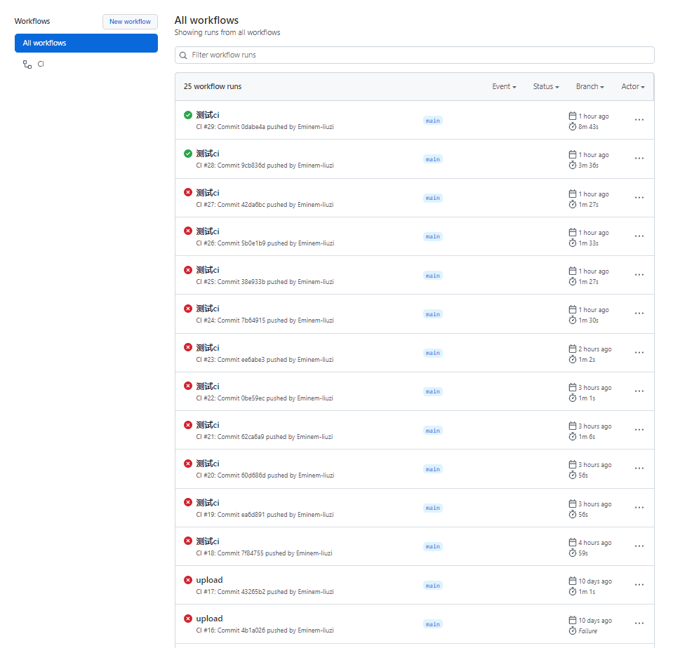

::: tip 介绍
懒癌使用vuepress搭建的第一篇博客<br>
:::

<!-- more -->


## 懒癌下午突发奇想博客搭了一半还没搭完

首先安装node环境

如何使用vuepress搭建并发布一个博客`express`


创建项目文件目录
```
mkdir vuepress-starter && cd vuepress-starter
```
初始化项目
```
yarn init # npm init
```
安装vuepress
```
yarn add -D vuepress # npm install -D vuepress
```
创建docs .md文件

```
mkdir docs && echo '# Hello VuePress' > docs/README.md
```
配置项目启动命令
```
{
  "scripts": {
    "docs:dev": "vuepress dev docs",
    "docs:build": "vuepress build docs"
  }
}
```
启动项目
```
yarn docs:dev # npm run docs:dev
```

## 关于项目发布
关于项目文件发布，你可以选择用日常用的FTP部署到服务器，
但是在更新发布项目需要登陆FTP会比较麻烦，可以选择为项目配置CI自动化上传发布功能，后续会出一篇关于 **GitHub+Action+FTPci**自动化发布教程。

看下面图片的部分失败记录就知道我踩了多少坑....

[vuepress](https://www.vuepress.cn/),有问题邮箱咨询




